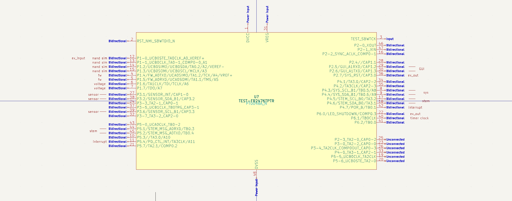

## Test Hardware

### MSP430FR2476 side

Use a FR2476 LaunchPad

Pinout on the launchpad reserves pins for

- Two voltage measurements
- Input pins that trigger an interrupt message
- Input pins that update an input register
- Output pins driven by an output register
- Sensor I2C that can be proxied to an Expander register
- Stem I2C + 1-Wire negotiation pins

Drive it with 3V3 from Raspberry Pi.

A motion sensor MC6470 is connected to SENSOR I2C.
Additionally an Ambient light meter APDS-9960 as well.

Connect a pair of UART P5.1 + P5.2 pins combined to STEM_MSG.

Connect P1.6 to the LiPo battery(on nRF52 side) for level measuring.

Connect P1.7 to VBUS(on nRF52 side) for level measuring.

### Raspberry Pi setup

Use Python 3 to run PyTests 

Connect the MSP430 to pins 3, 5, 21, 24, 26, 29, 31 to command it.
As test GPIO pins use RPi pins 7, 11, 27, 28, 36.
Connect RPi VCC_FULL to CHARGE pin.
Connect a LiPo battery to VSOM pin.
Connect pins 21 and 24 together.

| Left side                  | Function  |Pin |Pin | Function  | Right side           |
|----------------------------|-----------|----|----|-----------|----------------------|
|  When VSOM fully connected | LIVE_3V3  | 1  | 2  | VCC_FULL  | When VSOM fully connected  |
|       I2C3 SDA / STEM_SDA  | SDA       | 3  | 4  | VCC_FULL  | When VSOM fully connected |
|       I2C3 SCL / STEM_SCL  | SCL       | 5  | 6  | GND       |                      |
|                            |           | 7  | 8  | TxD       | UART2 TxD            |
|                            | GND       | 9  | 10 | RxD       | UART2 RxD            |
|                            |           | 11 | 12 | SPI1      | PD CTL SPI CS     |
|     SDIO DAT3 / GPIO2_IO18 | SDIO      | 13 | 14 | SWD       | (RPi GND)              |
|      SDIO CLK / GPIO2_IO13 | SDIO      | 15 | 16 | SDIO      | SDIO CMD / GPIO2_IO14  |
|    When any VSOM connected | SLEEP_3V3 | 17 | 18 | SDIO      | SDIO DAT0 / GPIO2_IO15 |
|                            |           | 19 | 20 | GND       |                        |
|             STEM MSG RXD4  | MSG       | 21 | 22 | SDIO      | SDIO DAT1 / GPIO2_IO16 |
|                            |           | 23 | 24 | MSG       | STEM MSG TXD4          |
|                            | GND       | 25 | 26 | SCL       | SENSOR SCL             |
|                    SYS I2C | SYS SDA   | 27 | 28 | SCL       | SYS I2C              |
|                 SENSOR INT | INT       | 29 | 30 | (GND)     |                      |
|                 SENSOR SDA | SDA       | 31 | 32 | TxD       | UART4 TX             |
|                   UART4 RX | RxD       | 33 | 34 |           |  (RPi GND)           |
|            PD CTL SPI MISO | SPI1      | 35 | 36 |           |                      |
|     SDIO DAT2 / GPIO2_IO17 | SDIO      | 37 | 38 | SPI1      | PD CTL SPI MOSI      |
|       SYS_PRG (GND on RPi) |           | 39 | 40 | SPI1      | PD CTL SPI CLK       |

Future revisions will add SWD/SBWT programming pins switched in over the SDIO pins.

### nRF52 side (later test setup)

Use an nRF52 dev board(such as Adafruit Feather [nRF52 Bluefruit LE](https://docs.zephyrproject.org/1.14.0/boards/arm/nrf52_adafruit_feather/doc/), [pinout](https://learn.adafruit.com/bluefruit-nrf52-feather-learning-guide/device-pinout)) with USB for easy programming and battery input connector. Pick nRF52832/33/40 for dual I2C support. PSEL allows mapping of GPIO pins to I2C/UART freely.
It represents a low power application processor of type M0 / M4 / M7.

Connect to Sensor I2C and Stem I2C as master. 
This allows both processors to access the sensors and the nRF52 to read and write I2C registers on the MSP430.
It also allows nRF52 to simulate sensors in slave mode.

Connect a pair of UART RXD + TXD pins to STEM_MSG.

Connect a LiPo battery

Implement testing software based on Zephyr RTOS.
Use device tree to configure I/O Expander communication compatible with PCA9555.

Document how to connect to the nRF52 for programming and console log.

GPIO pins configuration
- TWI: STEM SCL, STEM SDA
- TWI: SENSOR SCL, SENSOR SDA
- UART: STEM MSG (TX), STEM MSG (RX)
- 

- [Zephyr uart peripheral driver](https://github.com/Riphiphip/zephyr-uart-driver-example)
