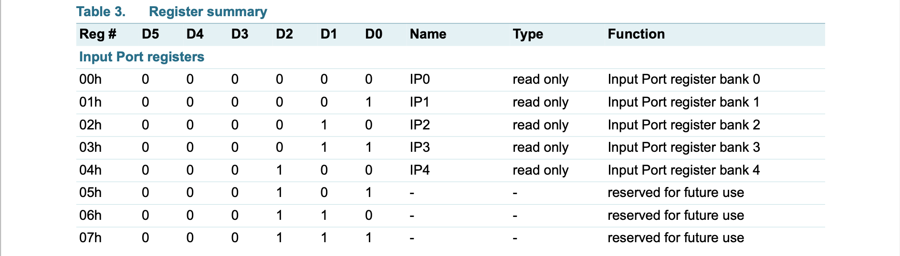
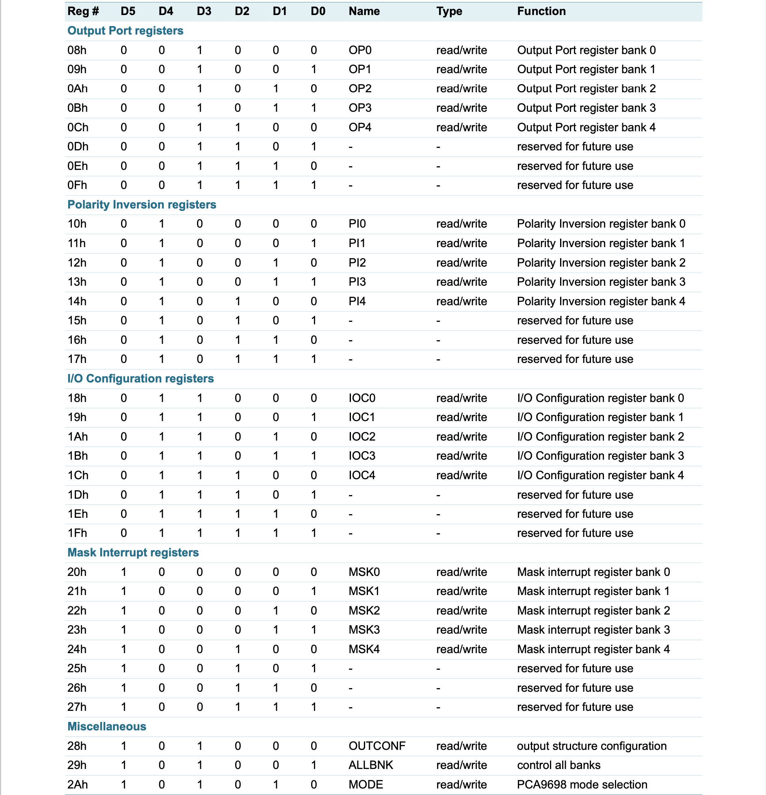

## I2C Expander API

The firmware supports the emulation of a PCA9698 expanded to support 8 pin ports.
In principle this supports 64 GPIO pins, but due to some being assigned to other functions
the maximum with be ~52 pins.
In addition the API will also support Voltage metering and I2C sensor proxying.

Special pins needed at a minimum are

- Stem SCL
- Stem SDA
- Stem MSG
- min. 1 interrupt output pins
- MSP RST
- MSP TEST

The MSP430 P1 - P8 ports are mapped directly to I/O Expander I2C ports.
For each port a mask must also be set to screen out pins that should be left alone.

Registers Input, Output and Config must directly drive off the native pin registers.
The Polarity & Mask Interrupt must be maintained by the firmware as there is no native support.

The open-drain interrupt output is activated when one of the port pins changes state and the pin is configured as an input. The interrupt is deactivated when the input returns to its previous state or the Input Port register is read (see Figure 12). A pin configured as an output cannot cause an interrupt. Since each 8-bit port is read independently, the interrupt caused by Port 0 will not be cleared by a read of Port 1 or the other way around.

The I/O Expander I2C API is enabled by calling `stemI2C(scl_pin, sda_pin, i2c_address)`.

### From the PCA9698 Datasheet

### 7.3 Command Register / Part

Following the successful acknowledgement of the slave address + R/W bit, the bus master will send a byte to the PCA9698, which will be stored in the Command register.

The lowest 6 bits are used as a pointer to determine which register will be accessed.
Registers are divided into 2 categories: 5-bank register category, and 1-bank register category.

### 7.4 Register definitions

The standard register allocation has reserved entries for bank 5-8. The firmware will support these.

If the Auto-Increment flag is set (AI = 1), the 3 least significant bits are automatically incremented after a read or write. This allows the user to program and/or read the
8 register banks sequentially.

5-bank register category

* IP – Input registers
* OP – Output registers
* PI – Polarity Inversion registers
* IOC – I/O Configuration registers 
* MSK – Mask interrupt registers

1-bank register category

* OUTCONF - Output Structure Configuration register
* ALLBNK - All Bank Control register
* MODE - Mode Selection register

If more than 1 byte of data is written or read, previous data in the same register is overwritten independently of the value of AI.

#### 7.4.4 IOC0 to IOC4 - I/O Configuration registers
These registers configure the direction of the I/O pins.

    Cx[y] = 0: The corresponding port pin is an output. 
    Cx[y] = 1: The corresponding port pin is an input.

Where ‘x’ refers to the bank number (0 to 4); ‘y’ refers to the bit number (0 to 7).

Pins are configured as input by default.
Note that this is the inverse bit values of the MSP430 configuration registers.

#### 7.4.5 MSK0 to MSK4 - Mask interrupt registers

These registers mask the interrupt due to a change in the I/O pins configured as inputs. ‘x’ refers to the bank number (0 to 4); ‘y’ refers to the bit number (0 to 7).

    Mx[y] = 0: A level change at the I/O will generate an interrupt if IOx_y defined as input (Cx[y] in IOC register = 1).
    Mx[y] = 1: A level change in the input port will not generate an interrupt if IOx_y defined as input (Cx[y] in IOC register = 1).

### Voltage and more as Misc. Register

Additional registers are added within the PCA9698 command framework.

#### 2Bh 101011 - Init Code Binary

Allows setting the Init function called on startup/reset.
The code will be persisted.

#### 2Ch 101100 - VSOM voltage (read)

Reading this register must return a value reflecting the volate at the P1.6 pin(configurable).

#### 2Dh 101101 - CHARGE voltage (read)

Reading this register must return a value reflecting the volate at the P1.7 pin(configurable).

#### 2Eh 101110 - VSOM voltage threshold (16 bit write)

A message is sent if the threshold is passed.
Up to 3 x 16 bit thresholds can be set. LSB/MSB to be defined.

#### 2Fh 101111 - free

It could offer a way to set baud rate from master

### Extended Registers

#### 30h 110000 - 

#### 3Fh 111111 - 

### Custom Registers

- Custom registers

