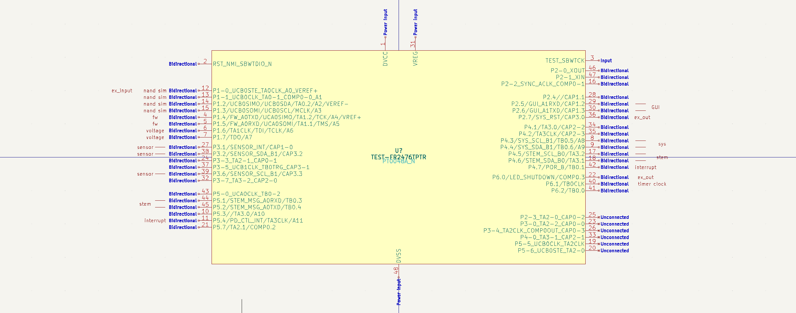

# MSP430 I2C firmware

The firmware must provide the following features

- I/O Expander API exposed on I2C (Stem)
- Event driven using interrupts
- Configuration driven using function calls during init
- Support persisting an initial pin output state
- I/O Expander API compatible with Linux Device drivers (emulate PCA9555)
- Build script running in a docker container
- Docker build container Debian based
- I can modify and recompile the init/configuration with a common code editor
- Written in C, C++ or Rust

You will create a GitHub repo for building and flashing firmware on a MSP430FR2476 evaluation board.
The build will output a binary image and be able to also flash the development board via USB.
The build is made to run from a shell on Unix.

Init function can configure
- The USI pins used for I2C port to listen on
- The GPIO pins used for I2C port to listen on
- The I2C address to respond to
- I/O Expander registers
- GPIO pins as input to I/O Expander register
- GPIO pins as output from I/O Expander register
- Initial register value
- Register callback for reading custom register
- 

The firmware will ultimately be written in Rust using [msp430_rt](https://docs.rs/msp430-rt/0.2.4/msp430_rt/),
with the initial version potentially being written in C or C++.

- [MSP430 timer sample code](https://embedded.fm/blog/ese101-msp430-timer-example)
- [Voltage monitor sample code](https://training.ti.com/msp430-housekeeping-voltage-monitor)
- [ADC wake and transmit on threshold](https://training.ti.com/msp-mcu-training-adc-wake-and-transmit-english?context=1147398-1147608-1147442)
- [Alternative I2C lib](https://github.com/jwr/msp430_usi_i2c)

## Test Hardware

Use a FR2476 LaunchPad

Pinout on the launchpad reserves pins for

- Two voltage measurements
- Input pins that trigger an interrupt message
- Input pins that update an input register
- Output pins driven by an output register
- Sensor I2C that can be proxied to an Expander register
- Stem I2C + 1-Wire negotiation pins

A nRF52 Adafruit Feather or Raspberry Pi Pico running Zephyr OS is connected to STEM I2C.

A motion sensor MC64.. is connected to SENSOR I2C

LEDs are connected to output pins.

## The Firmware

The firmware image should fit into 8K storage and need no more than 1Kb RAM

#### stemI2C(scl_pin, sda_pin, i2c_address)

This starts to listen for incoming I2C requests on the pins with the address. 
It will provide access to defined registers

#### stemMSG(rxd_pin)

This starts to listen for incoming 1-Wire coordination messages other Stem participants

#### exOutput(reg_no, bit_mask)

Registers an output pin that will be kept up to date based on the specified bit in a register

#### exInput(reg_no, bit_mask, int_no)

Registers an input pin that will be reflected in a specified bit in a register.
If int_no is specified it will generate a message over STEM_MSG.

#### exInterrupt(int_no)

Registers an input pin that is used for interrupts. When raised it will generate a message over STEM_MSG.

#### Voltage Measurement

The firmware must be able to monitor when voltage on a registered pin drops below a specific level.
The voltage is LiPo charging compatible, so between 2.8V - 5.0V.

#### Registers

- MSG baudrate
- GPIO byte registers
- Inversion register
- Custom registers

## Future enhancements

#### Soft I2C

Some MSP430 chips only have one I2C port. To support additional I2C pins
an option must be added to run over GPIO.

sysSoftI2C(scl_pin, sda_pin, i2c_address)

sensorSoftMonitor(scl_pin, sda_pin, int_pin, i2c_address)

#### exCustomRegister(reg_no, callback/async fetching) 

Register callback for reading custom register

You can register a callback that will be triggered when a specific register is read over I2C.
The register would be uniquely reserved for this functionality.
The callback would then fetch the information and send it as a response.

### sensorMonitor(scl_pin, sda_pin, int_pin, i2c_address)

Monitor I2C sensor

Respond to interrupt and read registers on sensor.
Do computation of result and update local register.
If passing threshold on local register trigger an interrupt or write I2C destination.

## 1-wire messaging (STEM INT/MSG)

An UART RXD capable pin from each MCU is used message between MCUs on the Stem.
The pins are all connected together for low bandwidth message exchange.

Each MCU is required to listen in when they are not sending to track who is the master.
Any MCU can send a request to be a master identifying itself using its I2C address

- [CCL & USART & 1-WIRE & MCU communication](https://www.avrfreaks.net/forum/ccl-usart-1-wire-mcu-communication-closedsuccess)

#### stemSendMSG(rxd_pin, message_len, message_bytes)

Messages are queued for sending.

Sending the message will wait for the bus to quiet down.
Messages can reserve a busy period in milliseconds from when it was sent.

Based on their own address MCUs will wait a number of milliseconds of quiet before sending.

